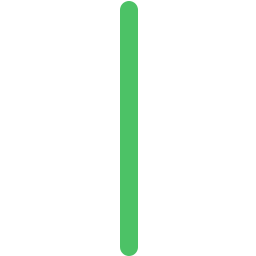

<h1 align="center">
  Hi , I'm Andrii Horlov
</h1>

  Senior Unity Developer | VR/XR Specialist | Passionate about immersive technologies

I specialize in creating innovative VR/XR applications, Unity tools, and immersive experiences. 
With a deep understanding of Unity's ecosystem, I focus on simplifying workflows for developers and creating engaging experiences for users.

##

  <h3>Stay connected!</h3>

  
  
  
  
  
  

## 📦 Featured Projects

| Project Name (Source)         | Description                                     | Status                               | Test                               |
|----------------------|-------------------------------------------------|--------------------------------------|--------------------------------------|
| 

 | VR Gallery - an interactive journey through captivating artwork, with access to detailed information, all seamlessly integrated with Meta Quest 2 and could be adaptable to diverse client needs.             | 
  
        | 

| 

 | BuildLogger is a powerful utility designed to streamline error debugging and troubleshooting in Unity applications.| 
 
 | 

| 

 | Unity Asset Validator is a toolset that helps developers ensure the integrity of their Unity projects by identifying and fixing broken scripts, prefabs, and materials.| 
 
 | 

| 

 | A 2D game that I created at the beginning of my "Unity-journey"| 
  
 | 

| 

 | Another 2D game that I created at the beginning of my "Unity journey"| 
 
 | 

##

### 🛠 Skills & Tools

 

##

  
  

  

  

  
