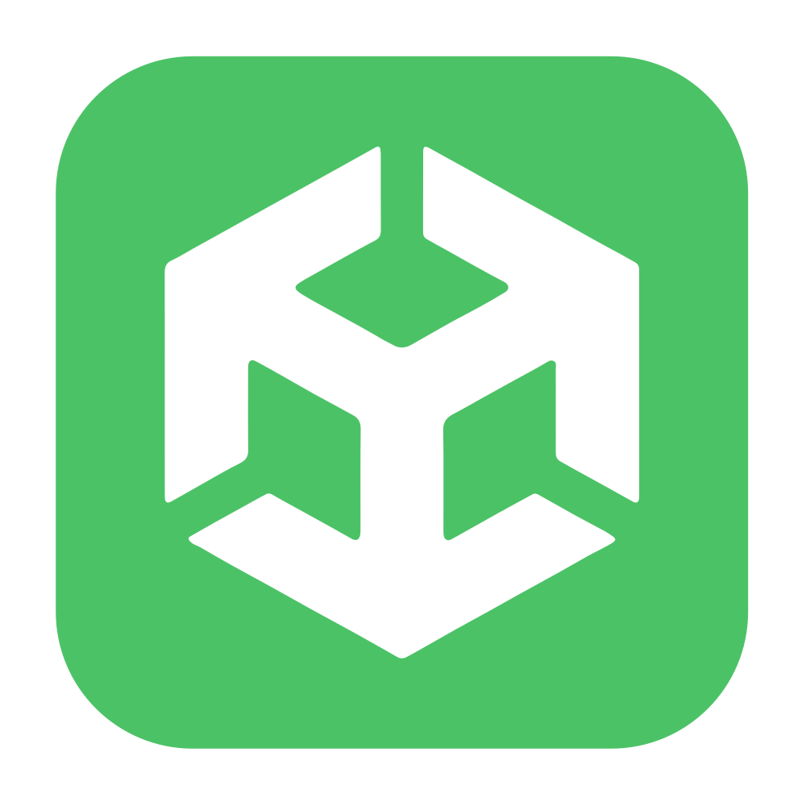

<h1 align="center">
  Hi , I'm Andrii Horlov
</h1>

  Senior Unity Developer | VR/XR Specialist | Passionate about immersive technologies

I specialize in creating innovative VR/XR applications, Unity tools, and immersive experiences. 
With a deep understanding of Unity's ecosystem, I focus on simplifying workflows for developers and creating engaging experiences for users.

##

  <h3>Stay connected!</h3>

  
  
  
  
  
  

##

### 🛠 Skills & Tools

  
  

  

  

  
